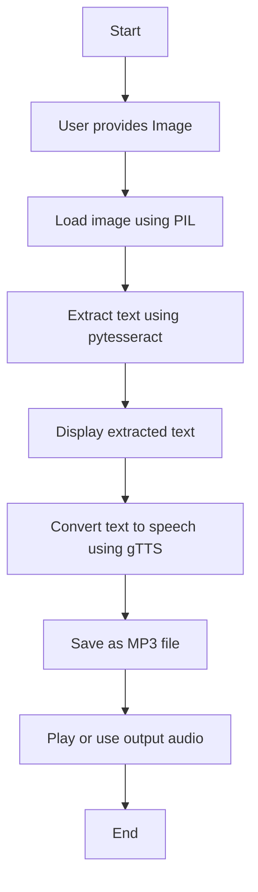

# Project-Image-to-Text-to-Audio
This project extracts text from images using Tesseract OCR and converts it into speech using Google's Text-to-Speech. It can be used for accessibility, document reading or language learning. Just upload an image and the system reads the text aloud!

