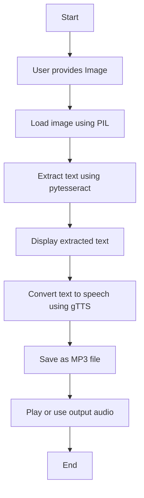

# Project-Image-to-Text-to-Audio
This project extracts text from images using Tesseract OCR and converts it into speech using Google's Text-to-Speech. It can be used for accessibility, document reading or language learning. Just upload an image and the system reads the text aloud!

## Features

- Extracts text from any image
- Converts text into speech (MP3 format)
- Easy to use and modify
- Built with Python
---

## Visual Overview


## Project Structure

```
📂 image-to-speech/
├── your-image.jpg
├── main.py
├── output.mp3
└── README.md
```
## Applications

1. Text reading aid for visually impaired users  
2. Voice-over from scanned documents  
3. Educational tools for language learners  
4. Automated reading for printed materials


